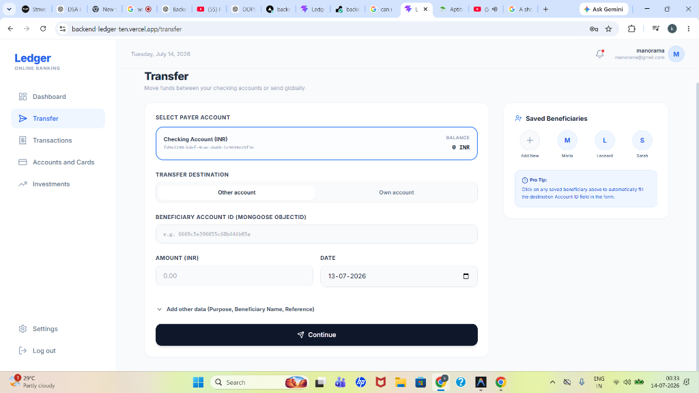
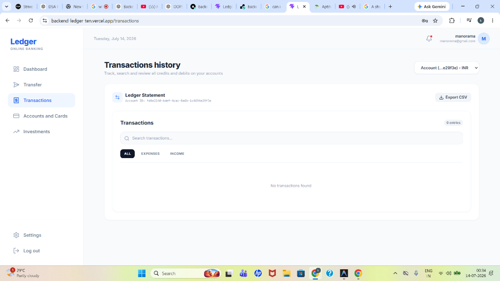

# Backend Ledger — Production-Grade Banking & Ledger System

A secure, high-performance, double-entry bookkeeping ledger system built using **Node.js, Express, React, Vite, and Prisma (PostgreSQL)**.

---

## 🌟 Production-Grade Features Implemented

This project includes advanced engineering patterns commonly found in production-grade banking systems:

1. **Database Indexes**: Speeds up queries from linear $O(N)$ table scans to logarithmic $O(\log N)$ traverses using single and composite indexes.
2. **Soft Delete**: Transactions are never deleted from the database. Deleting a transaction sets a `deletedAt` timestamp to comply with financial auditing regulations.
3. **Audit Logs**: A fire-and-forget logging framework that tracks user actions (Logins, Registration, Account Creation, Transfers, and soft deletes) with metadata, client IP, and User-Agent.
4. **Balance Cache Table**: Real-time balance queries read from a pre-computed `BalanceCache` table ($O(1)$ lookup) instead of dynamically summing millions of ledger records ($O(N)$ lookup).
5. **Optimistic Locking**: Uses a `version` count check on balance cache updates to detect and abort conflicting concurrent writes.
6. **Row-Level Locking (`SELECT ... FOR UPDATE`)**: Transactions lock balance rows in a deterministic order to prevent deadlocks and double-spending under concurrent loads.
7. **Serializable Transactions with Retry**: Key transfers run under `SERIALIZABLE` isolation with an automated retry loop using **exponential backoff with randomized jitter**.
8. **Reconciliation Engine**: An API to compare the cached balances against the ledger source of truth and automatically fix discrepancies.

---

## 📸 Screenshots

### 1. Secure Login Page


### 2. Main Dashboard (with O(1) Balance Cache & Seed Funding)


### 3. Peer-to-Peer Transfer (with Row-Level Locking & Serializable Isolation)


### 4. Paginated Transaction History (with Indexing & Soft Delete Support)


---

## 🛠️ How to Add Seed Funding

To test transfers, you need to add initial funds to your newly created account. This project has a built-in seed funding system.

### Why does the "Seed" button fail?
By default, the seed funding endpoint (`POST /api/transactions/system/initial-funds`) requires your user to be marked as a **`systemUser`** in the database. Standard registered users will receive a `403 Forbidden` response.

### How to set `systemUser = true`:

#### Option A: Using Prisma Studio (Easiest)
1. In your terminal, go to the project root directory and run:
   ```bash
   npx prisma studio
   ```
2. This opens the Prisma database visualizer in your browser (usually at `http://localhost:5555`).
3. Click on the **User** model.
4. Locate your user record, double-click the **`systemUser`** column checkbox to set it to **`true`** (checked).
5. Click **Save Changes** in the top right corner.
6. Go back to your frontend dashboard and click **Seed 5,000 INR**. It will successfully seed your account from the system reserve account!

#### Option B: Executing SQL command directly
If you are using a PostgreSQL database client (like pgAdmin, DBeaver, or Render's shell), run the following query:
```sql
UPDATE "User" SET "systemUser" = true WHERE email = 'your-email@example.com';
```

---

## 🚀 How to Run Locally

### 1. Prerequisites
* Node.js installed.
* PostgreSQL database connection string (`DATABASE_URL`).

### 2. Run Backend
1. Create a `.env` file in the root directory:
   ```env
   DATABASE_URL="postgres://..."
   JWT_SECRET="your_secret"
   JWT_REFRESH_SECRET="your_refresh_secret"
   ```
2. Install packages & generate the Prisma client:
   ```bash
   npm install
   npx prisma db push
   npx prisma generate
   ```
3. Run the backend server:
   ```bash
   npm run dev
   ```

### 3. Run Frontend
1. Open a new terminal in the `client/` directory.
2. Install packages:
   ```bash
   npm install
   ```
3. Start Vite dev server:
   ```bash
   npm run dev
   ```
